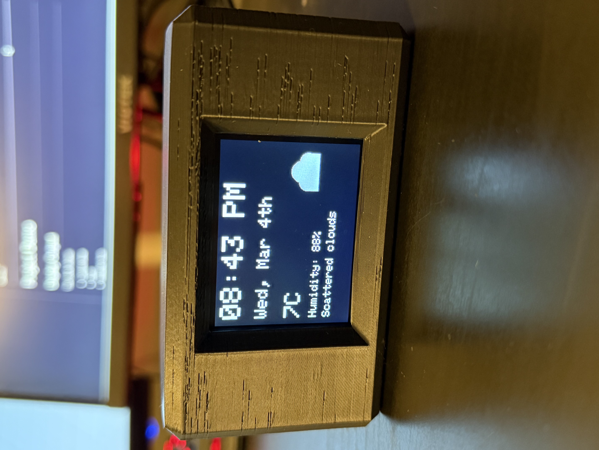
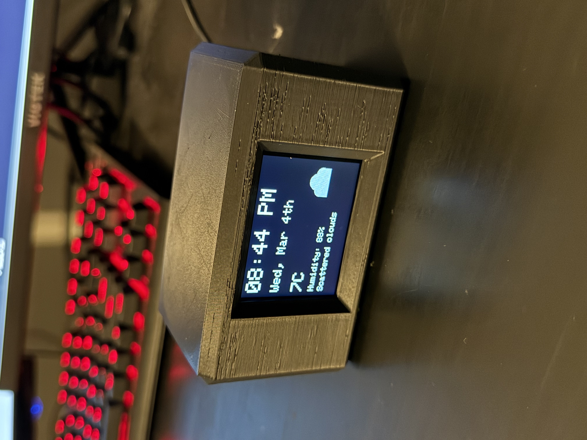
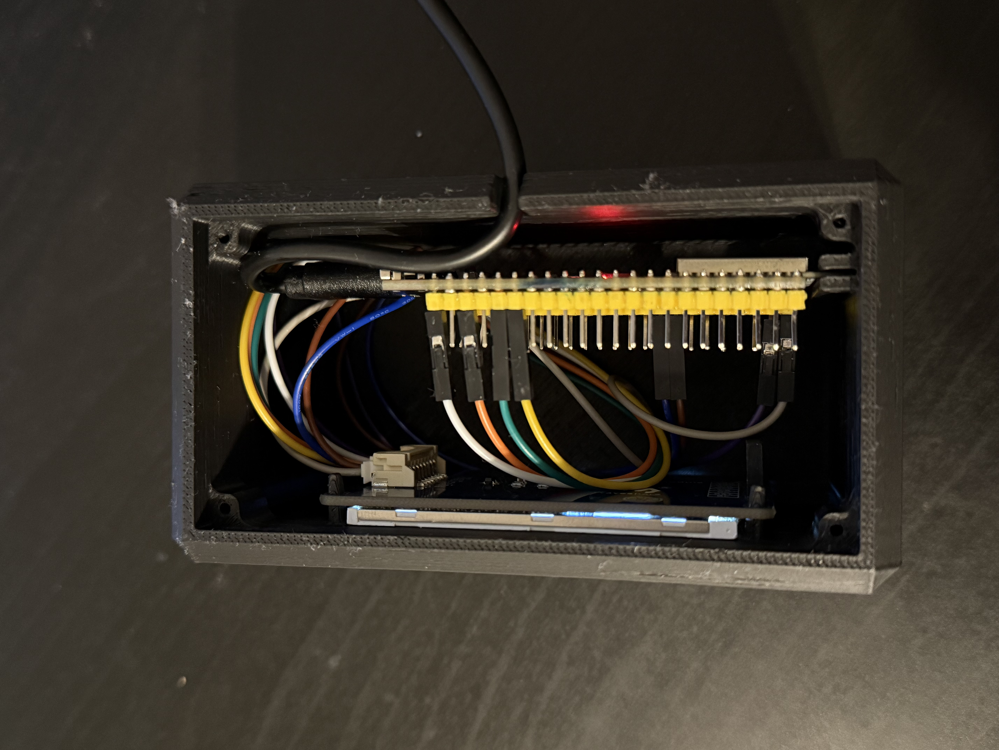

# ESP32 WiFi Weather Clock

A WiFi-connected smart desk clock built using an **ESP32-S3** and a **2.4" ILI9341 TFT display**.
The clock automatically synchronizes time with the internet and displays live weather data via the OpenWeather API.

The project combines **embedded systems, internet APIs, and graphical display programming** to create a compact IoT device.

---

# Project Demo

## Display Output

The clock shows:

* Current time
* Date
* Weather icon
* Temperature
* Humidity
* Weather description

Example display layout:

```
--------------------------
|        3:42 PM         |
|      Thu, Feb 19th     |
|                        |
| 14°C                   |
| Humidity: 72%          |
| Light Rain             |
|               (icon)   |
--------------------------
```

## Device

Add photos here:

```





```

---

# What I Learned

This project helped me develop experience in several areas of **embedded systems and IoT development**.

### Embedded Programming

* programming microcontrollers using Arduino
* managing hardware peripherals like SPI
* building graphical user interfaces on small displays

### Networking and IoT

* connecting embedded devices to WiFi
* retrieving real-time data from internet APIs
* parsing JSON data on microcontrollers

### Hardware Prototyping

* wiring SPI displays
* debugging hardware connections
* power management for microcontrollers

### UI Design for Embedded Devices

* reducing screen flicker
* optimizing refresh rates
* designing readable display layouts

### Rapid Prototyping

* designing and printing a custom enclosure
* integrating electronics into a physical product

---

# How It Works

The system follows a simple workflow.

```
WiFi → NTP Server → Current Time
        ↓
   OpenWeather API
        ↓
   ESP32-S3
        ↓
   ILI9341 Display
```

### Time Synchronization

The ESP32 connects to an **NTP server** to retrieve the current time.

```
pool.ntp.org
```

This ensures the clock stays accurate without needing manual adjustment.

### Weather Data

Weather information is retrieved from the **OpenWeatherMap API**.

```
https://api.openweathermap.org/data/2.5/weather
```

The ESP32 requests:

* temperature
* humidity
* weather description
* weather icon code

The data is returned in **JSON format**, which is parsed using the `ArduinoJson` library.

### Display Rendering

The ESP32 then renders:

* time
* formatted date
* weather icon
* temperature
* humidity

onto the **ILI9341 TFT display using SPI communication**.

---

# Hardware

## Components

| Component                  | Quantity | Approx Price |
| -------------------------- | -------- | ------------ |
| ESP32-S3 Development Board | 1        | $8 – $15     |
| ILI9341 2.4" TFT Display   | 1        | $6 – $10     |
| Jumper Wires               | ~10      | $3           |
| Breadboard                 | 1        | $3           |
| USB Cable                  | 1        | $5           |

Total project cost:

**≈ $25 – $40**

---

# Wiring Diagram

The display connects to the ESP32 via **SPI**.

| ILI9341 Pin | ESP32 Pin |
| ----------- | --------- |
| VCC         | 3.3V      |
| GND         | GND       |
| DIN (MOSI)  | GPIO21    |
| CLK (SCK)   | GPIO19    |
| CS          | GPIO47    |
| DC          | GPIO16    |
| RST         | GPIO15    |
| BL          | 3.3V      |

SPI initialization in code:

```
SPI.begin(19, 20, 21, 47);
```

---

# Software

## Required Libraries

Install through Arduino Library Manager:

```
Adafruit GFX
Adafruit ILI9341
ArduinoJson
```

Built-in ESP32 libraries used:

```
WiFi
HTTPClient
SPI
time
```

---

# Setup Instructions

### 1. Install ESP32 Board Support

Add the board manager URL:

```
https://raw.githubusercontent.com/espressif/arduino-esp32/gh-pages/package_esp32_index.json
```

Then install **ESP32 boards** in the Arduino Board Manager.

---

### 2. Select Board

```
Tools → Board → ESP32S3 Dev Module
```

---

### 3. Add WiFi Credentials

Update the code:

```
const char* WIFI_SSID = "YOUR_WIFI";
const char* WIFI_PASS = "YOUR_PASSWORD";
```

---

### 4. Add OpenWeather API Key

Create an API key:

```
https://openweathermap.org/api
```

Insert it in the code:

```
const char* OWM_API_KEY = "YOUR_API_KEY";
```

---

### 5. Upload the Code

Connect the ESP32 and click **Upload**.

If the upload fails:

1. Hold **BOOT**
2. Press **Upload**
3. Tap **RESET**
4. Release **BOOT**

---

# 3D Printed Enclosure

The project includes a **two-piece enclosure**.

Files:

```
Clock Body v2.stl
Clock Lid v2.stl
```

## Print Settings

| Setting      | Value  |
| ------------ | ------ |
| Material     | PLA    |
| Layer Height | 0.2mm  |
| Infill       | 15–20% |
| Supports     | None   |

Estimated print time:

| Part       | Time       |
| ---------- | ---------- |
| Clock Body | ~1.5hours   |
| Clock Lid  | ~0.5 hours |

---

# Assembly

1. Print both STL files
2. Insert the display into the front opening
3. Mount the ESP32 behind the display
4. Connect the SPI wiring
5. Close the enclosure with the lid

Optional mounting methods:

* hot glue
* screws
* double-sided tape

---

# Future Improvements

Possible upgrades:

* animated weather icons
* weather forecast
* touchscreen interface
* brightness control
* battery-powered version
* OTA firmware updates

---

# License

This project is intended for **educational and personal use**.

---

# Author

ESP32 WiFi Weather Clock Project - Blake Stewart
